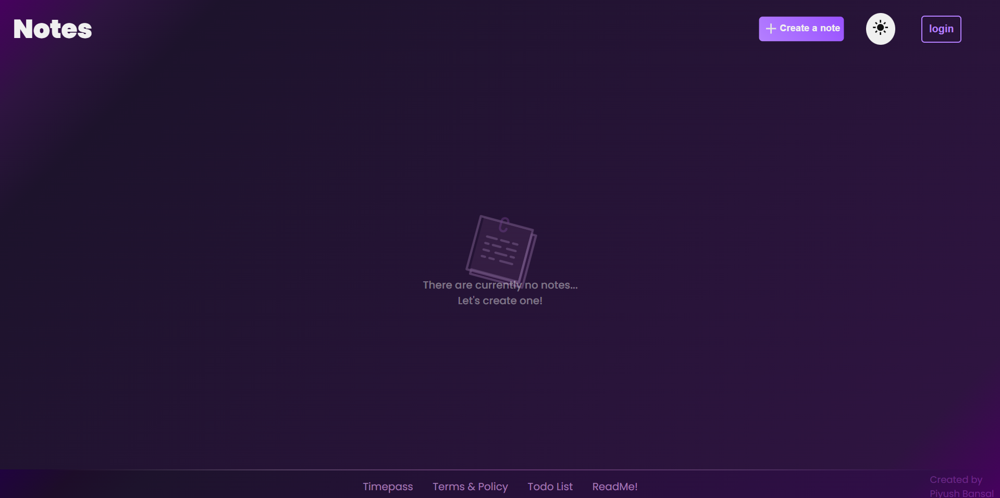
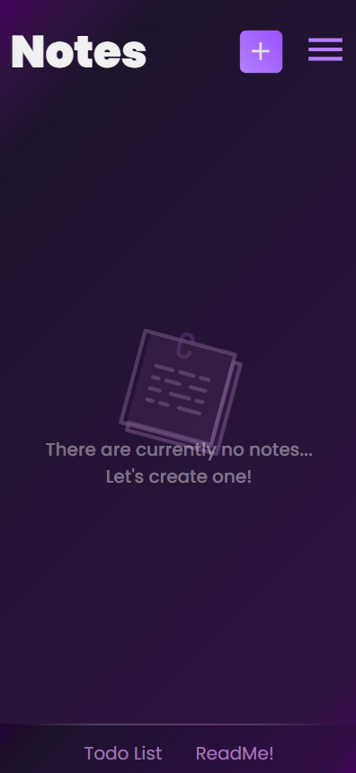
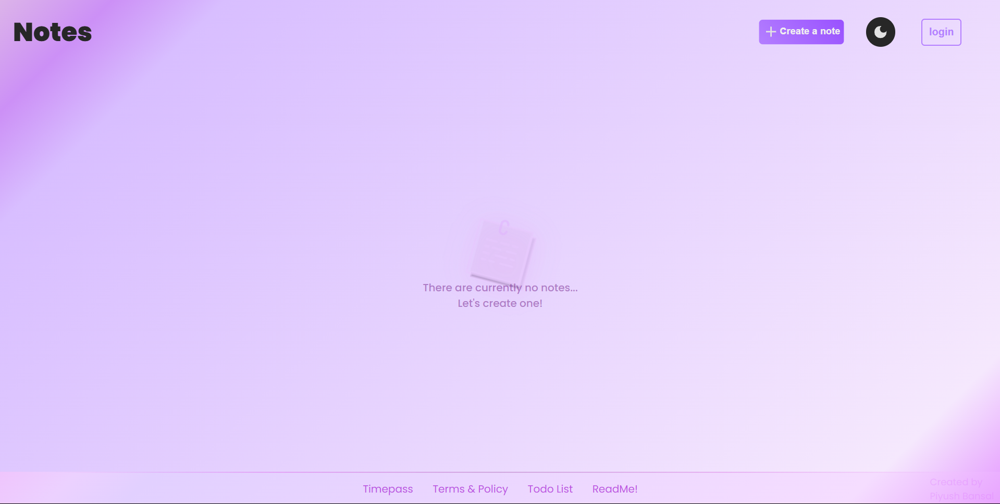
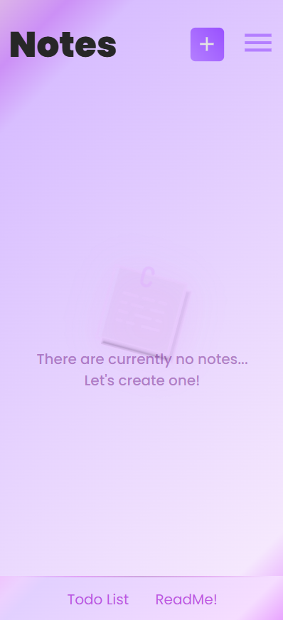
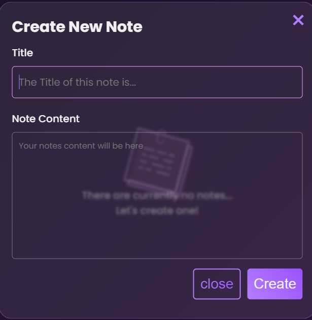
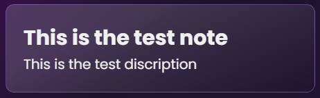
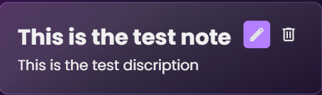
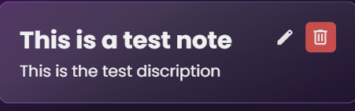

## Hey Guys! 👋
I have create another project which is *project-3*,
it took so much time and effort to complete this but finally this project is completed.
this website will help you to create various notes of yours and you can also access it after if you want.

the User Interface of this webapp looks like:-

OFcourse, this webapp is also responsive and it looks like this:-

- Features 💥

1. Theme Toggling ☀️🌙:- this webapp has light and dark theme toggling which is both are in gradient colours.
- the white theme if notes webapp looks like 
Desktop UI:-
    
Mobile UI:-
    

- the light theme or dark stored in the local storage of the web browser 💾 of the user's computer which increases the UX of the user.

2. Dialog to publish notes:- you can you publish teh notes by clicking at the *Create a note* button which opens the dialog of publishing the notes 
the dialog looks like this:-

- and ofcourse! it is also responsive and user can write the note title and the description or you can say the main topic whch the user has to white

3. Notes saving feature 💾 :- if the user created his/her's note then the note will be saved in the local storge and it can be seen after leavng the page 
the UI of notes looks like :-

4. Edit note feature 🖋️ :- this feature will enable to edit the posted note in order to modify the mistakes or update the track or any note 
the edit icon will be appear if you hover your mouse at the posted note 
the icon will look like this :-
 

5. Delete Note 🗑️ :- Users can also delete any posted note by clicking the trash icon. This permanently removes the note from local storage.
Here’s how it looks:

6. Responsive Navbar with Theme Toggle 🎨
The website includes a custom-made navigation bar that works seamlessly across both desktop and mobile screens.

- You can toggle between light and dark mode using the sun/moon icons in the navbar.

- It uses gradient backgrounds for better visual appeal.

- Mobile users get a hamburger menu 📱 that shows extra links like login and credits.

6. Login Page with Validation 🔐 :- There's a functional login page with basic validation for username and password.

- If you're a new user, there's a link to sign up.

- The login dialog can be opened using the "login" button in the navbar.

- Styled properly with responsive layout and error message feedback.

7. Clean UI and Smooth UX ✨

- Fully mobile responsive.

- Notes, dialogs, and buttons adapt according to screen sizes.

- Transitions and hover effects to give a nice feel when using the web app.

- All data is stored using localStorage so you won’t lose your notes even after refreshing or closing the tab.

## If you like to use this website, I request you to please give me some credit.
I will be creating more projects like this. 🙂

-Piyush Bansal